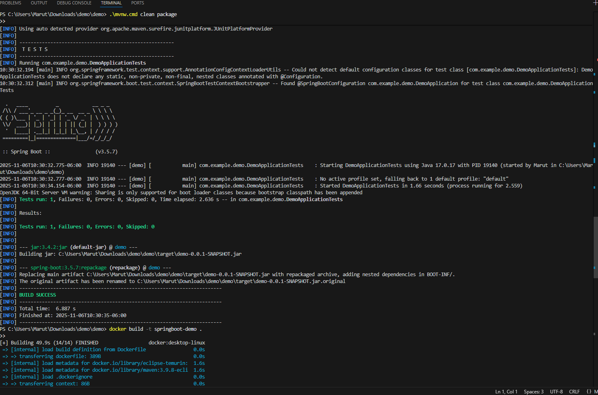
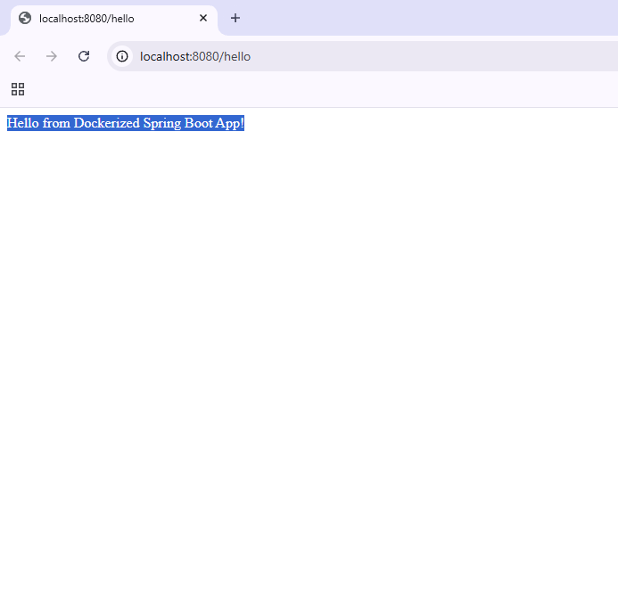

# Spring Boot Docker Demo
This repository demonstrates a fully functional Spring Boot microservice built with Java 17 and containerized using Docker. 
It includes source code, build steps, and proof of execution, making it suitable for demonstrating cloud-native deployment skills.

A simple Spring Boot application deployed with Docker.

---

## 🧩 Steps to Run

### 1️⃣ Build the JAR
```bash
.\mvnw.cmd clean package
```

### 2️⃣ Build the Docker Image
```bash
docker build -t springboot-demo .
```

### 3️⃣ Run the Container
```bash
docker run -p 8080:8080 springboot-demo
```

Then open your browser and go to:  
👉 [http://localhost:8080](http://localhost:8080)

You should see:
> **Hello from Spring Boot on Kubernetes!**

---

## 🐳 Dockerfile
```dockerfile
FROM eclipse-temurin:17-jdk-alpine
WORKDIR /app
COPY target/demo-0.0.1-SNAPSHOT.jar app.jar
EXPOSE 8080
ENTRYPOINT ["java", "-jar", "app.jar"]
```
---

## 🖼️ Demo Proof

### 🐳 Docker Container Running
The application successfully runs inside a Docker container — proof of containerization and proper Spring Boot packaging.



### 🌐 Browser Output
The application responds correctly on port 8080, showing the endpoint output from the running container.



---

## 🚀 Tech Stack
- **Java 17**
- **Spring Boot 3**
- **Maven**
- **Docker**
- **REST API**

---

## 🧠 Summary
This project demonstrates how to:
- Build and package a Spring Boot microservice using Maven  
- Containerize it with Docker for consistent deployment  
- Expose and test endpoints locally via `localhost:8080`  

This structure can be extended easily for cloud-native deployment using AWS ECS/EKS or Kubernetes manifests.


